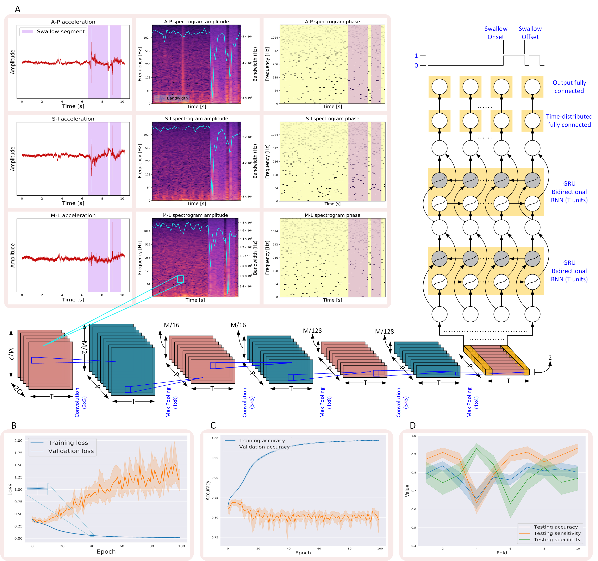
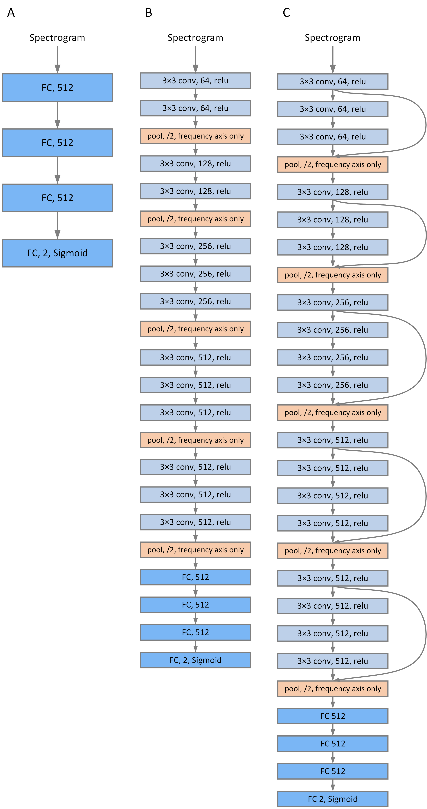

# Autonomus swallow segment extraction using deep learning in neck-sensor vibratory signals from patients with dysphagia

This code repository includes python scripts that train and test multiple deep networks for the purpose of automatic swallow segments extraction in acceleration (vibratory) signals collected from neck sensors as a necessary first step for using segmented signals for characterizing swallowing physiology and factors contributing to safe swallowing. The codes and scripts described here, were used to obtain the results and create graphics used in a manuscript which is under submission now and carries the same title as this repository.

All necessary codes to replicate the results of this manuscript can be found in this repository and the steps to do so will be detailed shortly. The dataset used in the paper includes vibratory signals of more 3k swallows collected from 248 patients who  developed dysphagia secondary to multiple etiologies. The details of the dataset can be found in the manuscript and the dataset itself can be downloaded [here](https://doi.org/10.5281/zenodo.4539695) for running the codes and replicating the results.

## Prerequisites nedded for running the codes

The following components are required for running the codes smoothly:

+ Python 3.7
+ NumPy >= 1.18.1
+ Pandas >= 1.0.2
+ scikit-learn >= 0.22.1
+ MatPlotLib >= 3.1.3
+ Seaborn >= 0.10.1
+ Librosa >= 0.8.0
+ h5py >= 2.8.0
+ Keras >= 2.3.1
+ TensorFlow >= 2.1.0

In our original experiments we utilized an Anaconda3 environment with the necessary packages installed to obtain the results.

## Running the main proposed model

The main model proposed in this manuscript, is a hybrid model that uses a shallow 2D CNN for extraction of local context features from both amplitude and phase components of the spectrogram of the acceleration signals. The CNN is then followed by a GRU-based RNN for sequential modeling and temporal correlation between adjacent windows from the spectrogram. The predictions showing which parts of the input spectrogram are swallows, are formed by combining the output of the RNN units through time distributed fully connected network.

The specifications of the spectrogram utilized in this experiment were as follows:

+ Window Length = 800 samples (200 msec)
+ Hop Length = The shift induced to the moving window = 400 samples (100 msec)
+ FFT Length (M) = 512
+ Sequence Length (T) = 10 windows
+ Sequence Hop Length = 5 windows

The dimensions of the network input are T\*(M/2)\*C\*2, where T is the sequence length, (M/2) is the positive frequency components of the FFT (256) and C is the number of acceleration channels (3 channels). The provided data include only raw acceleration signals and labels, so a feature generator should be executed ahead of running the main traiing/testing script. The intended script for feature generation is [batch_gen_features.py](./batch_gen_features.py) and it computes all spectrogram components, performs feature normalization and generates the propoer labels for the formed sequences. The path to the dataset should be set (variable: 'data_prepath') ahead of the running this feature generator.

The architecture of the main model is described in the following figure:

The main script performing training and testing of for model is [main.py](./main.py). The path to processed features generated in the previous step is set in the params dictionary under the name of "data_dir". This script performs data splitting into the pre-set folds ahead of model evaluation according to the total number of sequences present in the dataset. We used 10-fold cross validation in our experiment. For each fold, the script handles model training and testing plus generating the aggregated logits (predictions from the entire fold test set) which is used for calculation of ROC curves in addition to the logits corresponding to each signal file of the dataset. Due to the fact that each signal file was split into multiple sequences in the feature generation step, the code performs a combinatory process to combine the logits from all adjacently overlapping sequences for each signal file in order to generate the logits of the entire file.

The functions dedicated for feature extraction, normalization and labels generation are present in the class file [feature_procesor.py](./feature_procesor.py). The classes and methods dedicated to splitting the feature into folds, data generation for training/testing in Keras and logits aggregation processes are all present in the extra classes file [helper_classes.py](./helper_classes.py).

To evaluate the model performance over the test sets from the 10 folds, ROCs can be created using the script called [plot_ROC.py](./utilities/plot_ROC.py) which needs the path to the folder containg the results of running the model to be set ahead of running to collect the aggregated logits produced by the testing procedure.

## Other models included

The manuscript icluded the evaluation of 8 other models for performance comparison. The models evaluated include:

1. A feed-forward network that takes the spectrogram as input, but produces predictions for  each window separately (non-sequence-based). This network is described in details in this manuscript: [Non-invasive identification of swallows via deep learning in high resolution cervical auscultation recordings](https://www.nature.com/articles/s41598-020-65492-1). The script associated with this model is [main_noseq.py](./main_noseq.py) and it performs everything as the original model's script with the only difference that it doesn't rely on sequnces. The model parameters include a window length of 800 samples and a window hop length of 400 samples.
2. A hybrid network with a 1D shallow CNN followed by a GRU-based RNN that takes the raw signals as input and processes them in a sequnce based manner in a similar way to what's done in the main proposed network but with raw signals as input. This architecture has been recently used and proven effective for event detection in the same type of signals and is described on details in this manuscript: [Upper Esophageal Sphincter Opening Segmentation With Convolutional Recurrent Neural Networks in High Resolution Cervical Auscultation](https://arxiv.org/abs/2010.04541). The script associated with this model is [main_raw.py](./main_raw.py). The model parameters include a window length of 66 samples, a window hop length of 33 samples, a sequnce length of 50 windows and a sequnce hop length of 25 windows.

3. The rest of the experimented models are variants of the three previously described models, created by either increasing the depth through adding more CNN layers or usind residual learning to compensate for deep networks' accuracy saturation and/or performance degradation (please refer to this [manuscript](https://arxiv.org/abs/1512.03385) for more information about residual learning). The modifications are done as described in the following figure:

    

    The figure shows a glimpse about modifying the non-sequnce-based fully connected network model (A) by adding CNN layers to convert to a deep [VGG16-like](https://arxiv.org/abs/1409.1556) model (B). The right diagram (C) shows how the VGG16 variant is modified to utilize residual learning. The same concept is followed for creating variants of the other models.

The same [ROC script](./utilities/plot_ROC.py) can still be used with the results of all models by changing the results directory path in the script to the intended model's results directory.

## Calculating percentage of agreement (overlap) with gold standard ground truth segmentation

The previously described ROC evaluation of the models is solely based on the prediction accuracy on the window level but not a swallow segment. The predictions from the models should be compared to the ground  truth segmentation of the swallow segments to evaluate the percentage of the swallow segment detected by each of the models. The process is done on the aggregated logits produced for each signal file. To calculate the overlap percentages for each swallow in the dataset, the script called [calculate_overlap_seqmodels.py](./utilities/calculate_overlap_seqmodels.py) can be used with the results of the models that rely on processing sequences (main model and model using raw data and all their variants) while the script called [calculate_overlap_nonseqmodels.py](./utilities/calculate_overlap_nonseqmodels.py) can be used with models that process in a window by window manner (the feed-forward network and its variants). The results can be plotted through the script called [plot_overlap.py](./utilities/plot_overlap.py).